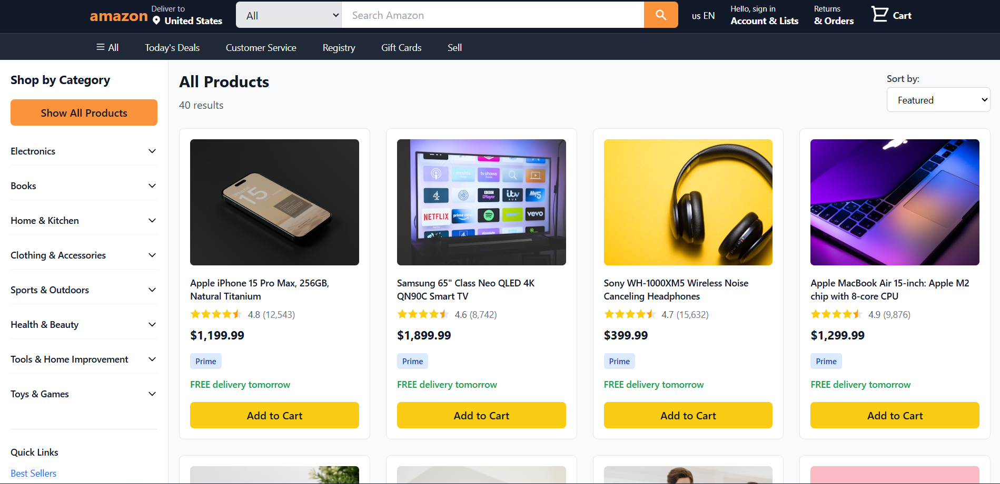
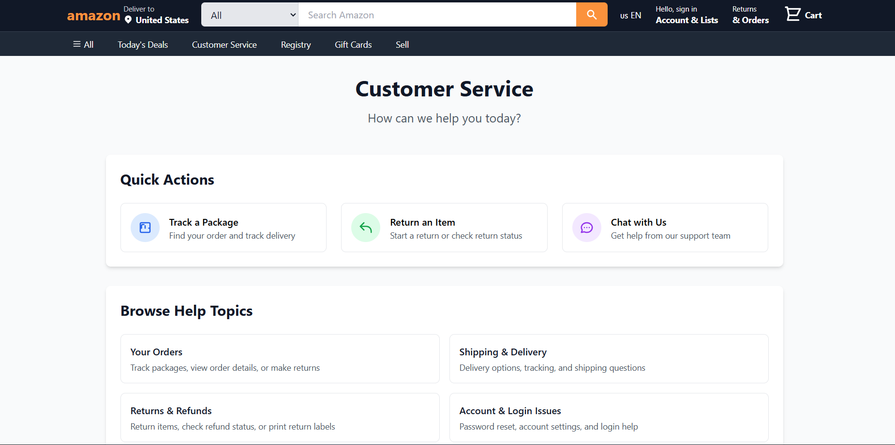
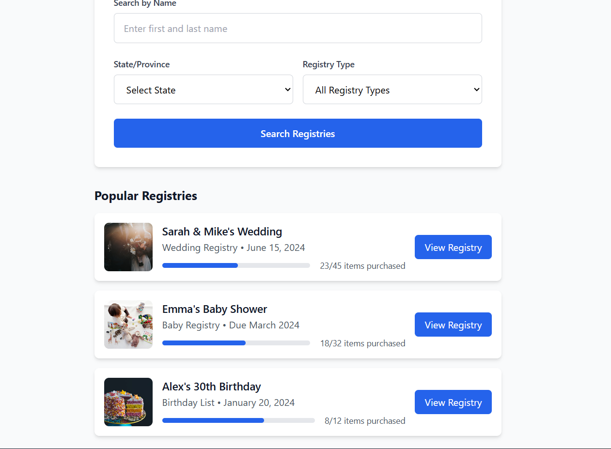
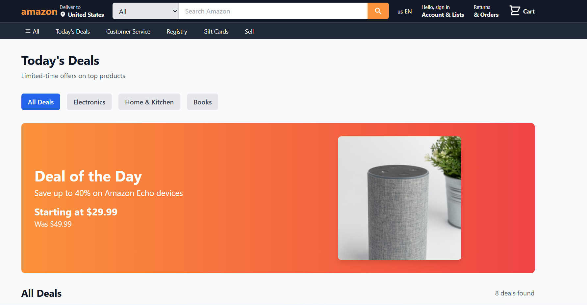

# Amazon Clone by Akshay Nallamala

A frontend **Amazon Clone** built with React.js and Firebase as the backend-as-a-service (BaaS). The project replicates e-commerce features such as product listings, shopping cart, user authentication, and order history.

---

## 🚀 Features

- 🛒 **Product Listings** – Browse a variety of products with details and images.  
- 🔍 **Search & Filter** – Quickly find products by keyword or category.  
- 🛍️ **Shopping Cart** – Add, remove, and manage cart items.  
- 👤 **User Authentication** – Secure login/signup using Firebase Authentication.  
- 💳 **Checkout & Payment** – Integrated payment simulation for order placement.  
- 📦 **Order History** – Track your previous orders.  
- 📱 **Responsive Design** – Works across desktop, tablet, and mobile devices.  

---

## 🛠️ Tech Stack

**Frontend:**
- React.js  
- Redux (for state management)  
- CSS / TailwindCSS  

**Backend-as-a-Service (BaaS):**
- Firebase Authentication
- Firebase Firestore Database
- Firebase Hosting (optional)

**Others:**
- Stripe (or mock checkout integration)  
- GitHub for version control  

---

## 📂 Project Structure

```
amazon-clone-akshay-exact/
├── src/
│   ├── components/       # Reusable UI components
│   ├── pages/            # Page-level components
│   ├── assets/           # Images, icons, fonts
│   ├── App.js            # Root application file
│   └── index.js          # Entry point
├── public/               # Static assets
├── package.json          # Dependencies and scripts
├── README.md             # Project documentation
└── ...
```

---

## ⚙️ Installation & Setup

Clone the repository and install dependencies:

```bash
git clone https://github.com/NallamalaAkshay/amazon-clone-akshay.git
cd amazon-clone-akshay-exact
npm install
```

Run the development server:

```bash
npm start
```

---

## 🔑 Firebase Setup

1. Create a [Firebase Project](https://console.firebase.google.com/).  
2. Enable **Authentication** (Email/Password or Google).  
3. Enable **Firestore Database**.  
4. Add your Firebase configuration to `firebase.js` in the project.  

---
## 📸 Screenshots

### 🛍️ Products Page


### 🛍️ customer Service Page


### 📝 Register Page


### 📦 Deals Page


### 📦 subscription Page


---

## 🌟 Future Improvements

- Add product categories & advanced filtering.  
- Integrate real payment gateways.  
- Add user profile and wishlist.  
- Deploy on **Vercel/Netlify** with backend on **Firebase/Heroku**.  

---

## 👨‍💻 Author

Developed by **Akshay Nallamala**  
📧 akshaynallamala03@gmail.com
🔗 [https://github.com/NallamalaAkshay]

---

## 📜 License

This project is licensed under the MIT License – free to use and modify.  
